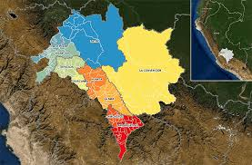
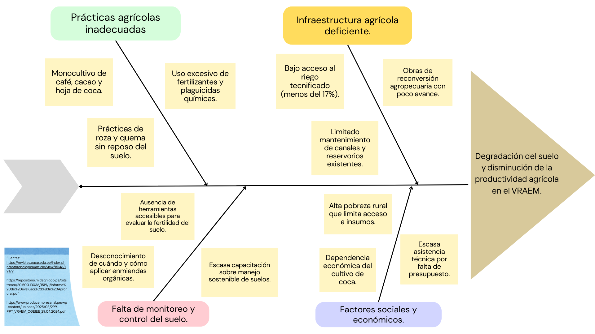

## 🌱 ODS 2: Hambre Cero

**🎯 Meta 2.4:**  
*"Para 2030, asegurar la sostenibilidad de los sistemas de producción de alimentos y aplicar prácticas agrícolas resilientes que aumenten la productividad y la producción, contribuyan al mantenimiento de los ecosistemas, fortalezcan la capacidad de adaptación al cambio climático, a fenómenos meteorológicos extremos, sequías, inundaciones y otros desastres..."*

**👥 Usuario objetivo:**  
Productores agrícolas y agricultores locales en zonas rurales del VRAEM, específicamente pequeños y medianos agricultores que cultivan productos como café, cacao, frutas y hortalizas.(Editar esta parte enfocar en un cultivo )

# ❗ Definición de la problemática  
# Degradación del suelo y disminución de la productividad agrícola en el VRAEM

El VRAEM enfrenta un serio desafío de degradación de suelos y consecuente disminución de la productividad agrícola. Cerca del 65 % de sus habitantes vive en situación de pobreza, con más de un 25 % en pobreza extrema, dependiendo principalmente de parcelas familiares para el cultivo de café, cacao, frutas y hortalizas [1]. Sin embargo, la economía regional se apoya en más del 80 % del valor agrícola en hoja de coca, cacao y café, lo que limita la diversificación productiva y el desarrollo de actividades industriales locales [2].

En esta región, prácticas como la deforestación y el uso intensivo de monocultivos (café, cacao y cultivos ilegales) han erosionado rápidamente los nutrientes y la materia orgánica del suelo, compactándolo y reduciendo su fertilidad [3]. Entre 2019 y 2021, Devida reportó que numerosas hectáreas en distritos como Anco, Anchihuay, Santa Rosa y Llochegua resultaron afectadas por degradación, atribuida al uso excesivo de la tierra y a la aplicación desmedida de agroquímicos [4]. 

### Referencias 
1. Ministerio de Defensa del Perú. Lineamientos para el empleo de las Fuerzas Armadas en el Valle de los Ríos Apurímac, Ene y Mantaro (VRAEM) [Internet]. Lima: Ministerio de Defensa; 2023 [citado 8 may 2025]. Disponible en: https://cdn.www.gob.pe/uploads/document/file/5216553/ANEXO%20RM%20996%20DE.pdf
2. Ministerio de la Producción del Perú. Valle de los Ríos Apurímac, Ene y Mantaro (VRAEM): Desempeño económico-productivo sectorial e Intervenciones de PRODUCE [Internet]. Lima: Ministerio de la Producción; 2024 [citado 8 may 2025]. Disponible en: https://www.producempresarial.pe/wp-content/uploads/2025/03/299-PPT_VRAEM_OGEIEE_29.04.2024.pdf
3. Ministerio de Desarrollo Agrario y Riego del Perú. Informe de Evaluación de Continuidad del Programa de Desarrollo Productivo Agrario Rural – AGRORURAL [Internet]. Lima: MIDAGRI; [citado 8 may 2025]. Disponible en: https://repositorio.midagri.gob.pe/bitstream/20.500.13036/1519/1/Informe%20de%20evaluaci%C3%B3n%20Agrorural.pdf
4. AgroPerú. Recuperan más de 4 mil hectáreas de suelos degradados en el Vraem [Internet]. AgroPerú; 2021 nov 16 [citado 8 may 2025]. Disponible en: https://www.agroperu.pe/recuperan-mas-de-4-mil-hectareas-de-suelos-degradados-en-el-vraem/

## 🛠️ Herramientas que nos ayudaron a identificar la problemática

## Mapa de empatía

### Referencias del mapa de empatía

1. Inforegión. Amazonía: nuevas zonas de cultivo ilegal de coca causan deforestación [Internet]. 2024 [citado 7 mayo 2025]. Disponible en: https://inforegion.pe/amazonia-nuevas-zonas-de-cultivo-ilegal-de-coca-causan-deforestacion/?utm_source=.com
2. Programa de Desarrollo del VRAEM (PROVRAEM). Capacitación integral del equipo técnico del Proyecto Suelos del PROVRAEM en certificación orgánica y zonificación forestal [Internet]. Gobierno del Perú; 2024 [citado 7 mayo 2025]. Disponible en: https://www.gob.pe/institucion/provraem/noticias/965217-capacitacion-integral-del-equipo-tecnico-del-proyecto-suelos-del-provraem-en-certificacion-organica-y-zonificacion-forestal?utm_source=chatgpt.com
3. Comisión Nacional para el Desarrollo y Vida sin Drogas (DEVIDA). VRAEM: Productores de café y cacao acceden a financiamiento para fortalecer su competitividad [Internet]. Gobierno del Perú; 2024 [citado 7 mayo 2025]. Disponible en: https://www.gob.pe/institucion/devida/noticias/1132359-vraem-productores-de-cafe-y-cacao-acceden-a-financiamiento-para-fortalecer-su-competitividad?utm_source=.com
4. Ministerio de Desarrollo Agrario y Riego (MIDAGRI). Ministro de MIDAGRI afirmó que los distritos del VRAEM tendrán su sistema de riego para impulsar la agricultura [Internet]. Gobierno del Perú; 2023 [citado 7 mayo 2025]. Disponible en: https://www.gob.pe/institucion/munipichari/noticias/1037332-ministro-de-midagri-afirmo-que-los-distritos-del-vraem-tendran-su-sistema-de-riego-para-impulsar-la-agricultura?utm_source=.com
5. Programa de Desarrollo del VRAEM (PROVRAEM). Proyecto Recuperación de Suelos realiza monitoreo de trabajo en campo [Internet]. Gobierno del Perú; 2024 [citado 7 mayo 2025]. Disponible en: https://www.gob.pe/institucion/provraem/noticias/1026694-proyecto-recuperacion-de-suelos-realiza-monitoreo-de-trabajo-en-campo?utm_source=.com
6. Diario El Peruano. Ponen en marcha proyecto de recuperación de suelos degradados en el VRAEM [Internet]. Lima: El Peruano; 2024 [citado 7 mayo 2025]. Disponible en: https://www.elperuano.pe/noticia/203985-ponen-en-marcha-proyecto-de-recuperacion-de-suelos-degradados-en-el-vraem?utm_source=chatgpt.com
7. Programa de Compensaciones para la Competitividad - AGROIDEAS. Caracterización y diagnóstico del ámbito del VRAEM [Internet]. Lima: AGROIDEAS; 2017 [citado 7 mayo 2025]. Disponible en: https://www.agroideas.gob.pe/wp-content/uploads/2017/12/PUBLICACIONES-VRAEM.pdf?utm_source=chatgpt.com

## Journal Map

### Referencias del Journal Map

1. Ministerio de Desarrollo Agrario y Riego (MIDAGRI). Resolución Directoral Ejecutiva Nº 056-2023-MIDAGRI-PROVRAEM-DE [Internet]. Lima: MIDAGRI; 2023 [citado 2025 May 7]. Disponible en: https://cdn.www.gob.pe/uploads/document/file/4282917/RDE%20N%C2%BA056-2023-MI)DAGRI-PROVRAEM-DE.pdf.pdf
2. AgroPerú. Reforestarán 1180 hectáreas de suelos degradados en el VRAEM [Internet]. AgroPerú; 2023 [citado 2025 May 7]. Disponible en: https://www.agroperu.pe/reforestaran-1180-hectareas-de-suelos-degradados-en-el-vraem/
3. Comisión Nacional para el Desarrollo y Vida sin Drogas (DEVIDA). VRAEM: Cerca de tres mil productores cacaoteros son asistidos en manejo integrado de plagas en 10 distritos [Internet]. Lima: Plataforma digital única del Estado Peruano; 2022 [citado 2025 May 7]. Disponible en: https://www.gob.pe/institucion/devida/noticias/482852-vraem-cerca-de-tres-mil-productores-cacaoteros-son-asistidos-en-manejo-integrado-de-plagas-en-10-distritos

## Diagrama de causa y efecto

### Referencias del diagrama de causa y efecto

1.	299-PPT_VRAEM_OGEIEE_29.04.2024.pdf [Internet]. [citado 8 de mayo de 2025]. Disponible en: https://www.producempresarial.pe/wp-content/uploads/2025/03/299-PPT_VRAEM_OGEIEE_29.04.2024.pdf
2.	Garland EB, Aramburú CE, Burneo Z. Una agricultura insostenible y la crisis del barbecho: El caso de los agricultores del valle de los ríos Apurímac y Ene- VRAE. Anthropologica. 1 de agosto de 2017;35(38):211-40.
3.	Informe de evaluación Agrorural.pdf [Internet]. [citado 8 de mayo de 2025]. Disponible en: https://repositorio.midagri.gob.pe/bitstream/20.500.13036/1519/1/Informe%20de%20evaluaci%C3%B3n%20Agrorural.pdf

