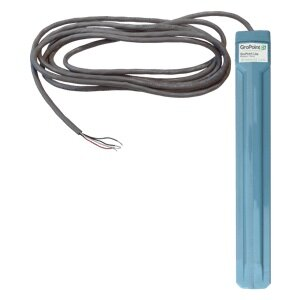

# 1. CONTEXTO CIENTÍFICO
### Artículo 1
 #### "Scalable IoT-based Smart Plant Monitoring and Control System for Sustainable Agriculture"
 
Foysal et al. (2025) presentan un sistema escalable de monitoreo y control inteligente para agricultura sostenible, basado en la integración de un microcontrolador ESP32 con capacidades de comunicación Wi-Fi y un conjunto de sensores de bajo costo. El sistema mide en tiempo real la humedad volumétrica del suelo, la temperatura, la concentración de iones de hidrógeno (pH) y la humedad ambiental, complementándose con un módulo de cámara para evaluación visual de la salud foliar. Los datos se procesan localmente en el “Edge” para ejecutar lógicas de riego y fertilización automáticas, antes de enviarlos a una plataforma en la nube para análisis histórico. Se destaca la recolección continua con intervalos ajustables (1–10 min), un diseño modular “plug & play” y la capacidad de integrarse en huertos urbanos o grandes fincas sin modificaciones de infraestructura[1].

### Artículo 2
 #### "IoT-Based Real-Time Soil Health Monitoring System for Precision Agriculture"

En este trabajo, los investigadores presentan un dispositivo compacto basado en ESP32S3 que incorpora varias sondas electroquímicas para medir en simultáneo la humedad, temperatura, pH y conductividad eléctrica del suelo, así como concentraciones de macronutrientes (N, P, K). El sistema realiza una rutinas de autorcalibración: utiliza un pequeño depósito con solución patrón (pH y conductividad conocidos) para ajustar dinámicamente las curvas de calibración cada 24 h. La transmisión de datos se lleva a cabo mediante LoRaWAN, alcanzando distancias de hasta 8 km en campo abierto. Las baterías recargables Li-Po de alta densidad ofrecen autonomía de hasta 14 días en modo de muestreo cada 15 min. Pruebas en parcelas de maíz mostraron una mejora del 15 % en la eficiencia de fertilización (N y P) y una reducción del 18 % en el consumo de agua comparado con métodos basados en calendario, así como la generación automática de mapas georreferenciados en la plataforma ThingsBoard[2].

### Artículo 3
#### "Development and Application of an IoT-Based System for Soil Water Status Monitoring in a Soil Profile"

Comegna et al. (2024) presentan SHYPROM, un sistema IoT de monitoreo del estado hídrico del suelo diseñado tanto para laboratorio como para campo. El prototipo emplea un microcontrolador ESP32-SIM800L con convertidores ADC de 12 bits que alimentan tres pares de electrodos capacitivos de acero inoxidable y dos transductores de presión MPX5100DP acoplados a tensiómetros porosos. Cada 30 min el dispositivo mide simultáneamente el contenido volumétrico de agua (θ) y el potencial matricial (h) en distintas profundidades, y calcula la curva de conductividad hidráulica K(θ) mediante el método de perfil instantáneo, alcanzando una correlación R² = 0.92 frente a equipos de laboratorio. La plataforma transmite los datos en tiempo real a ThingSpeak vía GSM/Wi-Fi, almacena una copia local en tarjeta SD y dispone de una app Android para visualización y alertas. SHYPROM demostró alta fiabilidad (> 30 días) y un costo por unidad inferior a USD 100[3].

### Artículo 4
#### "Development of Soil Moisture Monitoring by using IoT and UAV-SC for Smart Farming Application"
El prototipo GS-UAV-SC surge en el contexto de la agricultura de precisión, donde el monitoreo continuo de la humedad del suelo es vital para optimizar el uso del agua y mejorar el rendimiento de los cultivos. Mientras los métodos convencionales dependen de muestreos puntuales y costosos equipos de laboratorio, este sistema integra un sensor capacitivo de humedad de bajo costo (SEN0193) y un regulador DC–DC LM2596 montados en un tubo de inserción de 0,2 m para obtener lecturas directas in situ. La incorporación de un microcontrolador ESP8266 NodeMCU permite la adquisición y transmisión inalámbrica de datos mediante Wi-Fi, habilitando la comunicación entre la estación en tierra (GS) y un vehículo aéreo no tripulado (UAV) que actúa como “small cell” móvil. Este enfoque híbrido combina la alta resolución espacial de los sensores terrestres con la cobertura dinámica del UAV, superando limitaciones de acceso en terrenos extensos o de difícil acceso. La plataforma de software, basada en Google Firebase, procesa y almacena la información en la nube, ofreciendo visualización en tiempo real y generación de alertas automáticas según estados de humedad predeterminados. Así, el diseño propone una solución escalable y de bajo costo que puede adaptarse a diferentes tipos de suelo y condiciones ambientales, respondiendo a la creciente demanda de sistemas IoT para la gestión eficiente del recurso hídrico en la agricultura moderna[4].

# 2. CONTEXTO COMERCIAL
## 2.1 PATENTES
 ### 2.1.1 US 20150181817A1 – Sensor de humedad del suelo
 
Este invento define un sensor inalámbrico con cuerpo plano, dos electrodos inferiores y “barbillas” de anclaje que mide humedad, salinidad y temperatura. Transmite lecturas a un receptor que interrumpe el ciclo de riego al alcanzar un umbral predefinido, mejorando el ahorro de agua y reduciendo la deriva de calibración[5].

 
 
 Figura 1: Sensor de humedad del suelo
                                             

 ### 2.1.2 US 2015/0330932 A1 – Sensor capacitivo de humedad del suelo

El sensor descrito en la publicación US 2015/0330932 A1 utiliza una sonda capacitiva enterrada en el suelo cuya capacitancia, directamente influida por la humedad, se excita con un circuito en serie RLC sintonizado entre 100 y 300 kHz para maximizar la relación señal-ruido. La corriente resultante de la sonda se convierte en voltaje mediante un módulo I–V y, a continuación, un microcontrolador genera la señal PWM de excitación y digitaliza la medida con su ADC integrado, procesando así la información de humedad en tiempo real. Gracias a su diseño modular, todos los componentes pueden montarse en una única unidad compacta o separarse en un módulo de campo y otro de procesamiento, comunicándose mediante interfaces cableadas o inalámbricas, lo que facilita su instalación y transporte en aplicaciones agrícolas de campo[6].

Figura 2: Sensor capacitivo de humedad del suelo

 
 ### 2.1.3 US 7944220 B2-Sensor de contenido de humedad y métodos relacionados
 
El sensor descrito en la patente US 7,944,220 B2 emplea un bloque poroso de arcilla o gel que, al absorber agua del suelo, modifica la resistencia de un transductor encapsulado. Esa variación de resistencia se traduce en un voltaje proporcional, lo que permite medir con precisión el contenido de humedad y controlar sistemas de riego de forma automática . Al no contar con piezas móviles, el dispositivo responde en menos de 30 s y mantiene una señal estable a lo largo del tiempo. Además, su encapsulado resistente a la corrosión le confiere una larga vida útil incluso en condiciones agrícolas exigentes[7].

Figura 3: Sensor de contenido de humedad y métodos relacionados

### 2.1.4  US 11,674,944 B2: Sensor inalámbrico de humedad del suelo para enterrar

El sensor descrito en la patente US11674944B2 está construido alrededor de una carcasa tubular hueca que se inserta parcialmente en el suelo y se cierra con una cubierta extraíble en su extremo superior. Dicha carcasa cuenta con tres aberturas distribuidas a lo largo de su longitud para alojar internamente un sensor ultrasónico superior, un sensor ultrasónico inferior y al menos un sensor de temperatura, todos protegidos por un material acústicamente transparente que garantiza la precisión de las medidas. En su interior, un procesador embebido se encarga de adquirir los datos de estos sensores y de transmitirlos mediante un módulo inalámbrico (por ejemplo, LoRa) hacia una estación remota. La unidad incorpora además una fuente de energía recargable, mientras que la cubierta superior puede integrar opcionalmente un panel solar y una antena, permitiendo recargas in situ y extendiendo el alcance de la comunicación sin necesidad de mantenimiento frecuente[8].

## 2.2 PRODUCTO COMERCIAL
 ### 2.2.1 Vegetronix VH400

El sensor capacitivo de Vegetronix (VH400) mide el contenido volumétrico de agua en el suelo de 0 % a 100 % VWC con una resolución de aproximadamente ±1 %. Su cuerpo de ABS y fibra de vidrio es totalmente resistente a la corrosión y puede enterrarse a cualquier profundidad sin dañarse. Gracias a su diseño compacto y a la delgada geometría de la cuchilla, minimiza la perturbación de las raíces y ofrece una respuesta prácticamente instantánea. La salida analógica de 0–3 V permite integrarlo fácilmente en sistemas IoT, controladores de riego comerciales o cualquier data logger capaz de leer voltajes[9].

Figura 4: VH400 Monitoreo de sensores de humedad del suelo Beat Plants

 ### 2.2.2 Sensor de humedad del suelo analógico o digital preciso y confiable

El GroPoint™ Lite es un sensor compacto y robusto que mide el contenido volumétrico de agua del suelo de 0 % a 100 % VWC con una precisión de ±2 % y una resolución <0.2 % (en laboratorio) mediante su tecnología de Transmisión en Dominio del Tiempo (TDT⁵). Integra además medición digital de temperatura del suelo, todo alojado en un cuerpo IP68 que minimiza la perturbación de las raíces y resiste al enterramiento prolongado. Ofrece múltiples opciones de salida —SDI-12, RS-485, 0–5 mA o 4–20 mA— para su fácil integración en sistemas IoT, controladores de riego y data loggers, y viene calibrado de fábrica para la mayoría de suelos agrícolas con posibilidad de recalibración en campo[10].

Figura 5: Sensor de humedad y temperatura del suelo

  ### 2.2.3 TEROS 21-Sensor de potencial hídrico del suelo
El TEROS 21 de METER Group es un sensor de succión del suelo que emplea un núcleo poroso para equilibrar su humedad con la del terreno y, a través de un pequeño sensor capacitivo, calcula el potencial matricial sin necesidad de partes móviles ni recalibración en campo . Su electrónica interna ajusta automáticamente las variaciones de temperatura y mantiene la señal estable a lo largo del tiempo, mientras que la salida SDI-12 permite una conexión sencilla a registradores de datos y sistemas SCADA[11].

Figura 6: El sensor de potencial matricial TEROS 21

### Drones para la gestión del agua: Black Swift Technologies lanza un UAS con sensor de humedad del suelo
El paquete de mapeo de humedad de suelo de BST combina un dron fijo S2 con un radiómetro pasivo de microondas en banda L para mediciones volumétricas de humedad hasta 5 cm de profundidad y cobertura de hasta 600 acres por vuelo. Opera a baja altura (15–30 m AGL) gracias al sistema de gestión de vuelo SwiftCore, e integra un piloto automático avanzado, la interfaz SwiftTab para planificación de misiones y una estación terrestre portátil, generando mapas de humedad en tiempo real con resolución de hasta 15 m, lo que optimiza la eficiencia del riego[12].

## Referencias

1. **Foysal, F. M.**, **Mondal, S.**, **Riyad, T.**, **Sikder, S.**, **Hasan, J.**, **Amir, M. A.**, **Mishu, S. S.**, & **Rahman, M. S.** (2025). _Scalable IoT-Based Smart Plant Monitoring and Control System for Sustainable Agriculture._ Journal of Engineering Research and Reports, **27**(1), 16–32. [https://doi.org/10.9734/jerr/2025/v27i11365](https://doi.org/10.9734/jerr/2025/v27i11365)

2. **Khanal, K.**, **Ojha, G.**, **Chataut, S.**, & **Ghimire, U.** (2024). _IoT-Based Real-Time Soil Health Monitoring System for Precision Agriculture._ International Journal of Sensor Networks, **11**, 470–478. [https://www.researchgate.net/publication/382295328_IoT-Based_Real-Time_Soil_Health_Monitoring_System_for_Precision_Agriculture](https://www.researchgate.net/publication/382295328_IoT-Based_Real-Time_Soil_Health_Monitoring_System_for_Precision_Agriculture)

3. **Comegna, A.**, **Hassan, S. B. M.**, & **Coppola, A.** (2024). _Development and Application of an IoT-Based System for Soil Water Status Monitoring in a Soil Profile._ Sensors, **24**(9), 2725. [https://doi.org/10.3390/s24092725](https://doi.org/10.3390/s24092725)
4. **S. Duangsuwan, C. Teekapakvisit, M.M. Maw** "Development of Soil Moisture Monitoring by using IoT and UAV-SC for Smart Farming Application", Advances in Science, Technology and Engineering Systems Journal, vol. 5, no. 4, pp. 381-387 (2020).[https://www.astesj.com/publications/ASTESJ_050444.pdf](https://www.astesj.com/publications/ASTESJ_050444.pdf)
5. **Runge, T. H.**, **Hill, J. L.**, & **Zimmerman, J.** (2015). _Soil moisture sensor._ US Patent Application Publication **US2015/0181817 A1**, July 2, 2015. [https://patents.google.com/patent/US20150181817A1/en](https://patents.google.com/patent/US20150181817A1/en)

6. **Kumaran, H. H.**, & **Tomar, V.** (2015). _Soil moisture sensor._ US Patent Application Publication **US2015/0330932 A1**, November 19, 2015. [https://patents.google.com/patent/US20150330932A1/en](https://patents.google.com/patent/US20150330932A1/en)

7. **Lock, G.** (2011). _Moisture content sensor and related methods._ US Patent **US7,944,220 B2**, May 17, 2011. [https://patents.google.com/patent/US7944220B2/en](https://patents.google.com/patent/US7944220B2/en)
   
8. Larsen, R. L. (2023). In-ground wireless soil moisture sensor (U.S. Patent No. 11,674,944). U.S. Patent and Trademark Office
    [https://patents.google.com/patent/US11674944B2/en](https://patents.google.com/patent/US11674944B2/en)

9. **Vegetronix LLC.** (s. f.). _VH400 Soil Moisture Sensor._ Vegetronix. [https://vegetronix.com/soil-moisture-sensor](https://vegetronix.com/soil-moisture-sensor)

10. **GroPoint Technologies.** (s. f.). _GroPoint™ Lite Soil Moisture and Temperature Sensor._ [https://www.gropoint.com/products/soil-sensors/gropoint-lite](https://www.gropoint.com/products/soil-sensors/gropoint-lite)

11. **METER Group.** (s. f.). _TEROS 21 Soil Water Potential Sensor._ [https://metergroup.com/products/teros-21/](https://metergroup.com/products/teros-21/)
    
12. Black Swift Technologies, S2 UAS Soil Moisture Mapping Package
    [https://dronelife.com/2022/04/14/drones-for-water-management-black-swift-technologies-launches-uas-with-soil-moisture-sensor/](https://dronelife.com/2022/04/14/drones-for-water-management-black-swift-technologies-launches-uas-with-soil-moisture-sensor/)

 

