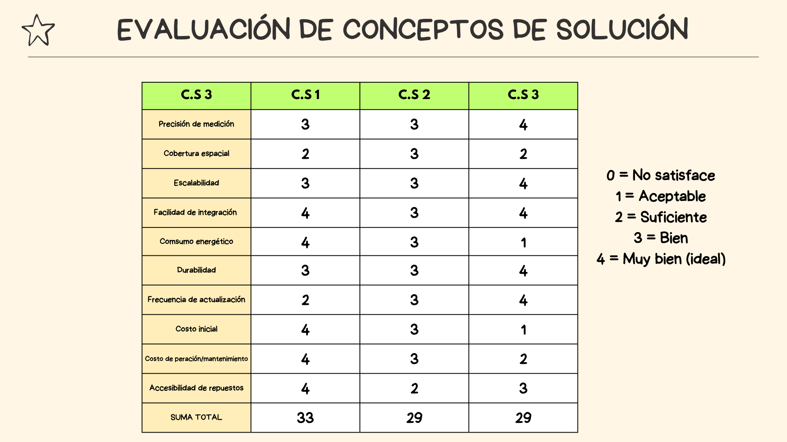

## MATRIZ MORFOLÓGICA Y TABLA DE VALORACIÓN
### Matriz morfológico

### Tabla de valoración

</section>
<section class="distancia-muestreo">
  <h2>Distancia mínima recomendada entre sensores para el monitoreo del suelo</h2>
  

    La distancia mínima entre puntos para el monitoreo de suelos agrícolas extensos depende principalmente de la variabilidad espacial, el tipo de manejo agronómico y el nivel de precisión requerido. En terrenos considerados homogéneos y con un manejo uniforme —es decir, aquellos que comparten características similares de cultivo, riego y pendiente— diversos estudios sugieren que una medición cada 1 a 2 hectáreas, equivalente a distancias aproximadas de 70 a 140 metros entre puntos, puede ser suficiente para representar con aceptable precisión variables como la humedad, temperatura y niveles de NPK <strong>[5]</strong>.
  

  

    De manera más precisa, se recomienda que un área comprendida entre 0.8 y 1.6 hectáreas (2 a 4 acres) pueda ser representada mediante la instalación de entre 12 y 30 sensores distribuidos sistemáticamente. Este patrón, bajo una cuadrícula regular, implicaría distancias de separación entre sensores de aproximadamente 20 a 40 metros <strong>[5]</strong>.
  

  

    No obstante, en suelos con mayor heterogeneidad, es fundamental adaptar la estrategia de muestreo para garantizar que los datos obtenidos sean efectivamente representativos de las condiciones del terreno. Una técnica altamente recomendada para estos casos es el muestreo condicionado por variables ambientales, conocido como Partitioned Conditioned Latin Hypercube Sampling (PcLHS). Este enfoque consiste en dividir el área de estudio en subzonas homogéneas mediante el análisis multivariado de factores como pendiente, textura del suelo o cobertura vegetal. Posteriormente, los puntos de muestreo se seleccionan de forma condicionada a estas variables, permitiendo una cobertura más eficiente de la diversidad del terreno sin requerir una cantidad excesiva de sensores <strong>[1][4]</strong>.
  

  

    Aunque el suelo es intrínsecamente heterogéneo, tanto en la práctica agrícola como en la investigación científica se reconoce la existencia de zonas homogéneas relativas, es decir, sectores donde las propiedades del suelo presentan una variabilidad limitada. En tales zonas, una muestra puntual o un sensor bien ubicado puede representar con precisión aceptable a un área mayor.
  

  

    Sin embargo, investigaciones han demostrado que incluso en parcelas pequeñas como aquellas de 30 x 30 metros la variabilidad interna del suelo puede ser significativa. Por ejemplo, en otras investigaciones se evidenció que se requerían múltiples sensores o núcleos para representar adecuadamente las condiciones del suelo en dichas áreas <strong>[2][3]</strong>. En función de estos hallazgos, se recomienda que, en terrenos heterogéneos, la distancia entre sensores no supere los 50 metros, ya que separaciones mayores podrían pasar por alto cambios importantes en la humedad, temperatura o concentración de nutrientes <strong>[2][3]</strong>.
  

</section>
 <section class="bibliografia">
  <h2>Bibliografía</h2>
  <ol>
    <li>
      Ministerio del Ambiente (MINAM). <em>Guía para el muestreo de suelos</em>. Lima: MINAM; 2013. Disponible en: 
      <a href="https://www.minam.gob.pe/calidadambiental/wp-content/uploads/sites/22/2013/10/GUIA-PARA-EL-MUESTREO-DE-SUELOS-final.pdf" target="_blank">
        https://www.minam.gob.pe/calidadambiental/wp-content/uploads/sites/22/2013/10/GUIA-PARA-EL-MUESTREO-DE-SUELOS-final.pdf
      </a>
    </li>
    <li>
      Li J. Sampling soils in a heterogeneous research plot. <em>Journal of Visualized Experiments</em>. 2018;(143). Disponible en: 
      <a href="https://www.jove.com/t/58519/sampling-soils-in-a-heterogeneous-research-plot" target="_blank">
        https://www.jove.com/t/58519/sampling-soils-in-a-heterogeneous-research-plot
      </a>
    </li>
    <li>
      Li J, Zhuang Q, et al. Sampling soils in a heterogeneous research plot. <em>J Vis Exp</em>. 2019;(e58519). Disponible en: 
      <a href="https://www.tnstate.edu/faculty/jli/Li_2018_JoVE.pdf" target="_blank">
        https://www.tnstate.edu/faculty/jli/Li_2018_JoVE.pdf
      </a>
    </li>
    <li>
      Brus DJ, et al. Sampling strategies for spatially heterogeneous soils. <em>Geoderma</em>. 2021;404:115288. Disponible en: 
      <a href="https://www.sciencedirect.com/science/article/abs/pii/S001670612100611X" target="_blank">
        https://www.sciencedirect.com/science/article/abs/pii/S001670612100611X
      </a>
    </li>
    <li>
      Kansas State University. How many cores should be taken for soil sampling? <em>K-State Agronomy eUpdate</em>. 2023. Article 3558. Disponible en: 
      <a href="https://eupdate.agronomy.ksu.edu/eu_article_prep.php?article_id=3558" target="_blank">
        https://eupdate.agronomy.ksu.edu/eu_article_prep.php?article_id=3558
      </a>
    </li>
    <li>
      Lozano-García DF, et al. Sensor-based fertility mapping using soil NPK sensors in agricultural fields. <em>Agronomy</em>. 2024;14(12):2947. Disponible en: 
      <a href="https://www.mdpi.com/2073-4395/14/12/2947" target="_blank">
        https://www.mdpi.com/2073-4395/14/12/2947
      </a>
    </li>
  </ol>
</section>

   

