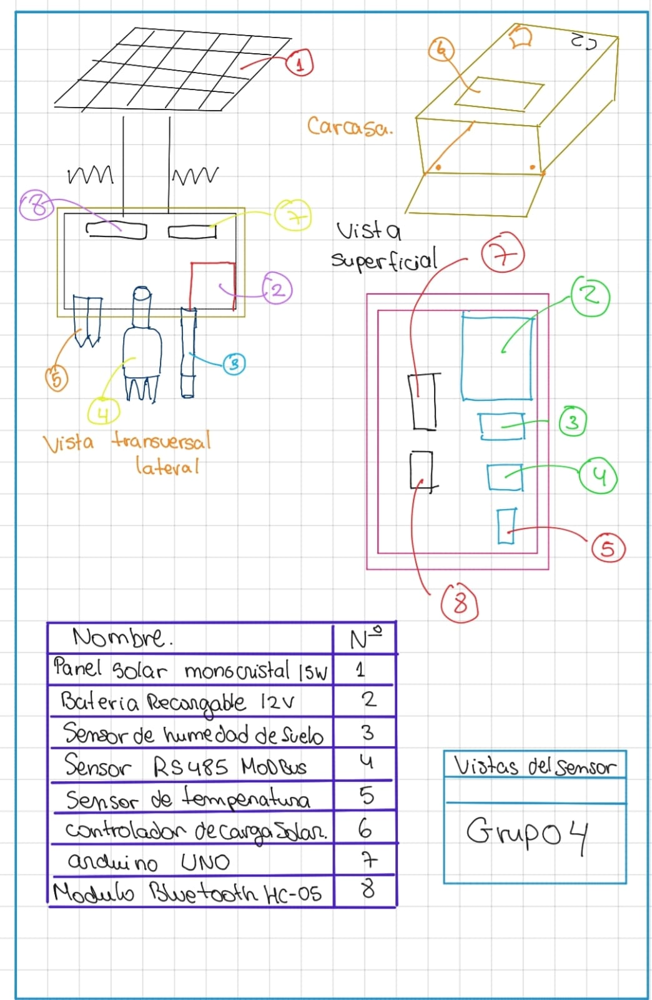
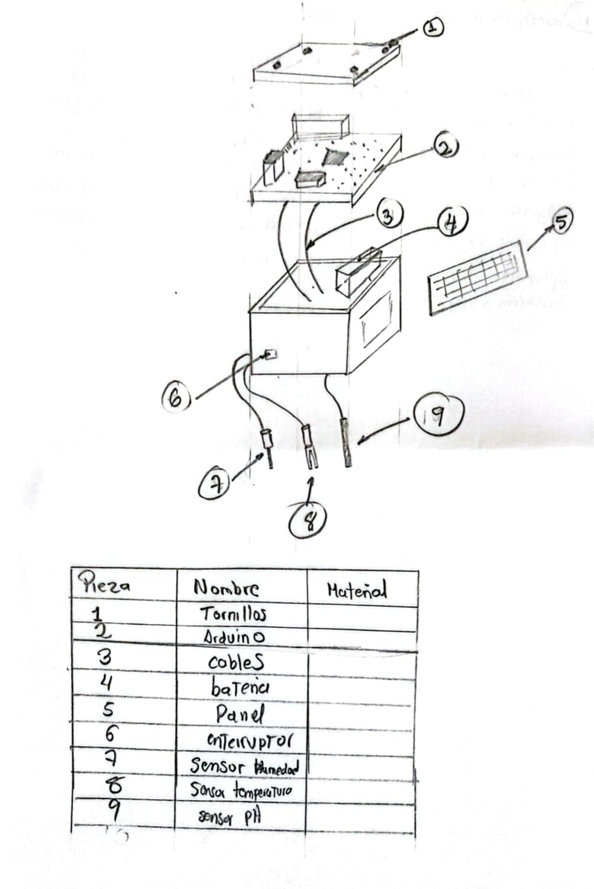
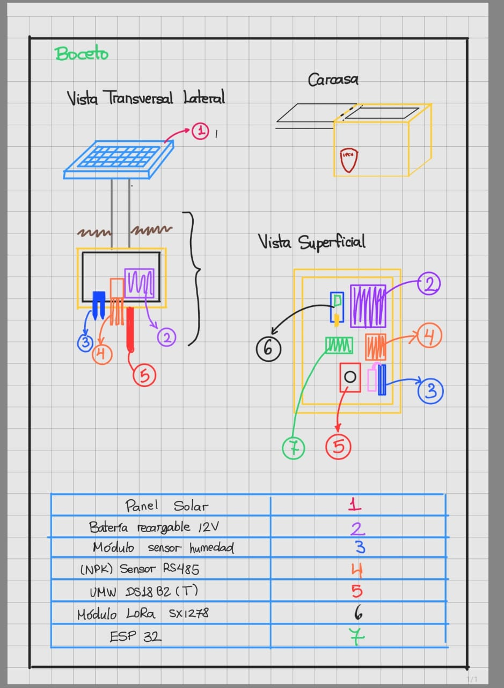

## Esquema a mano alzada
### Esquema 1
### Descripción del funcionamiento-C1
El panel solar permanece en la parte superior de la carcasa, inmerso en un diseño hermético que impide filtraciones, mientras que la etiqueta “Carcasa” se ha reubicado lateralmente para evitar confusiones con los cables de los sensores. Internamente, el microcontrolador recibe la energía generada por el panel y gestiona las lecturas de los tres sensores sumergidos en el suelo

### Esquema 2
### Descripción del funcionamiento-C2
un microcontrolador Arduino y una batería de respaldo. Para su operación, utiliza un panel solar montado en la parte superior que provee la energía necesaria y recarga la batería interna. Desde la base de la caja, tres cables flexibles conducen las señales de los sensores de humedad, pH y temperatura bajo la superficie del suelo. El software integrado programado para hacer lecturas cada intervalo definido transforma las señales analógicas en valores numéricos, los almacena y los transmite de manera inalámbrica o mediante cable de datos a una aplicación móvil para su visualización en tiempo real.

### Esquema 3
### Descripción del funcionamiento-C3
El panel solar esta Fuera del equipo y del ESP32. Tres cables de longitud precisa permiten introducir los sensores de humedad, pH y temperatura varios centímetros bajo tierra sin mover la unidad principal. El software interno ejecuta muestreos automáticos, aplica promedios para descartar lecturas atípicas y usa conectividad inalámbrica para enviar los resultados a la plataforma móvil.

Link: https://www.canva.com/design/DAGniHT5RHw/FZqDMqbeAxVe3l696WLT1g/edit?utm_content=DAGniHT5RHw&utm_campaign=designshare&utm_medium=link2&utm_source=sharebutton
