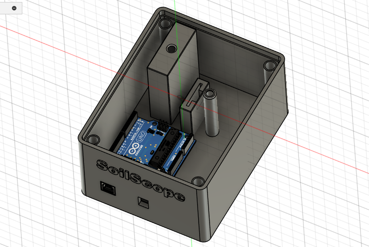
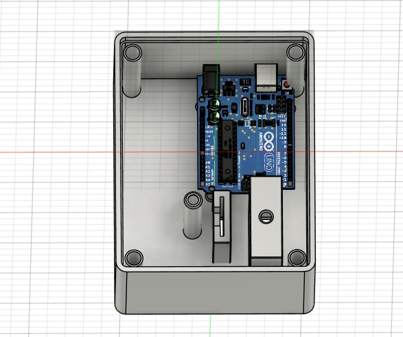
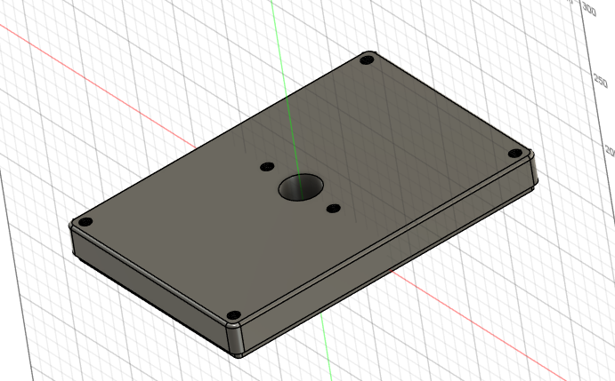
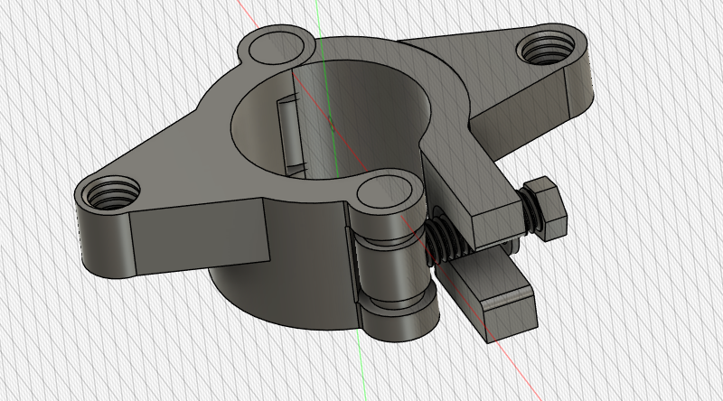
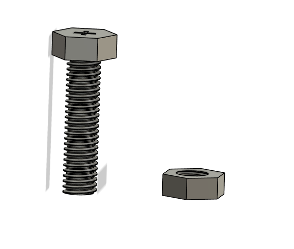
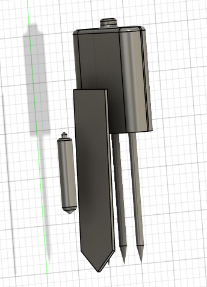
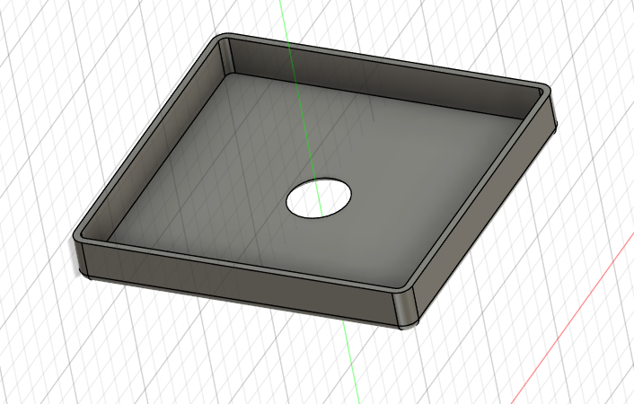
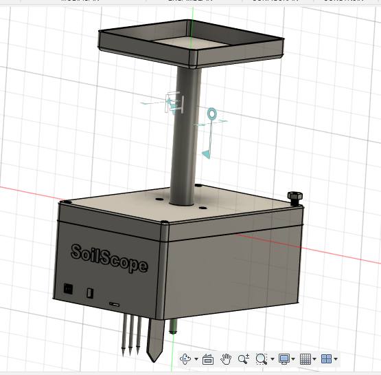
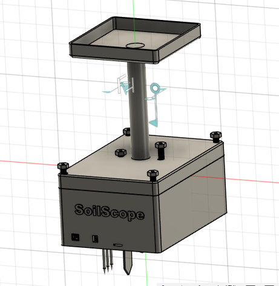

# Modelado del protipo propuesto
## Boceto de la caja

## Boceto caja

## Boceto de la tapa

## Boceto de la abrazadera

## Boceto del tornillo

## Boceto de los componentes

## Boceto de la caja del panel solar

##  Ensamblaje 

##  Ensamblaje

# LINK ONSHAPE
https://cad.onshape.com/documents/05428c828949c483dceebada/w/70bdcc359c642212f2441f81/e/ddc32dfcd612a7ea9bd640bc?renderMode=0&uiState=685479a73fb5f712567024d5
