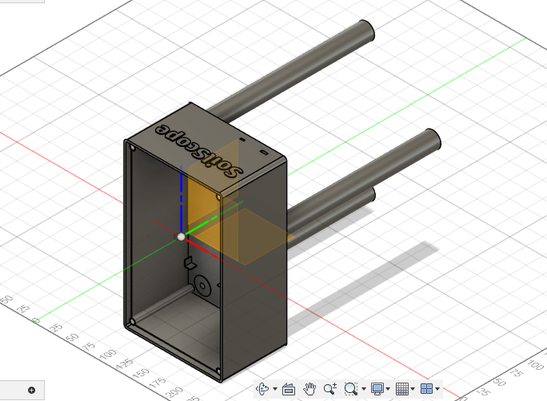
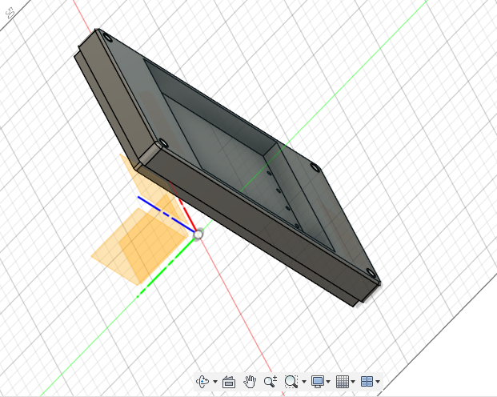

# Modelado del protipo propuesto
## Boceto de la caja

## Boceto de la tapa

## Boceto del tornillo

## El Emsamblaje 

#LINK ONSHAPE
https://cad.onshape.com/documents/75d9b4e9f09b672432283a20/w/d060acafd61f28a02a40f700/e/47f175c663c2f54870308a8c?renderMode=0&uiState=685418f461752c4fe365db0a
